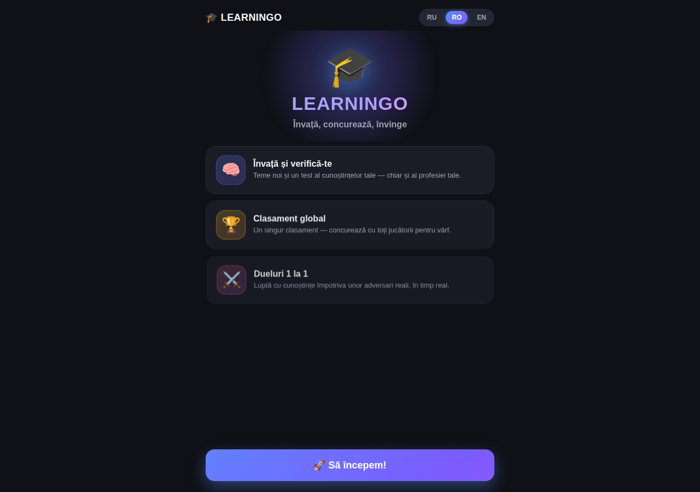
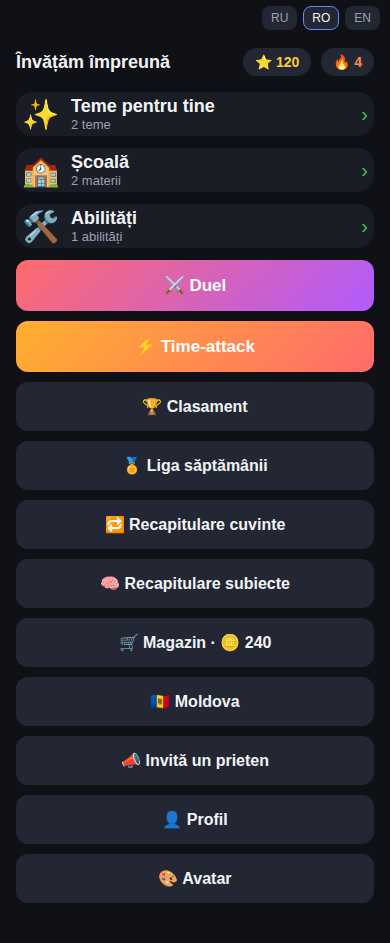
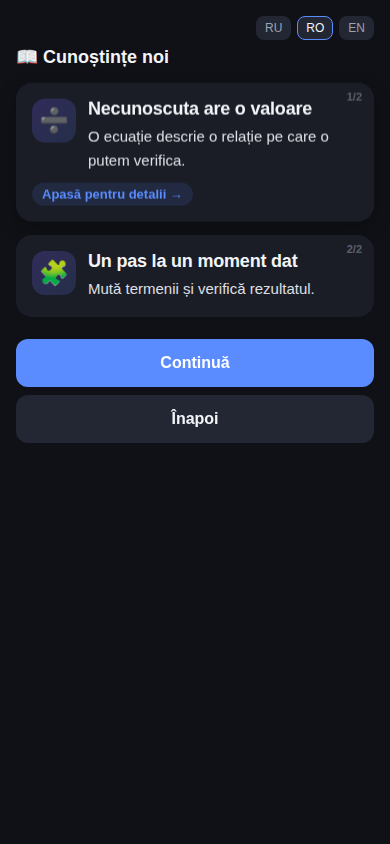

# Learningo — Telegram Mini App / web preview

[](https://github.com/luciandanileico94-dev/learning-platform-demo/actions/workflows/ci.yml)
[](https://learning-platform-demo-pi.vercel.app)
[](https://react.dev/)
[](https://www.typescriptlang.org/)

Learningo este o aplicație de învățare gamificată, construită pentru utilizare în Telegram Mini App și preview web. Demo-ul public păstrează shell-ul mobil și traseele produsului original: învățare, lecții, dueluri, time-attack, recapitulare, ligă, clasament, magazin, profil, avatar, Moldova și olimpiade.

[Deschide aplicația live →](https://learning-platform-demo-pi.vercel.app)

## Preview

<p align="center">
  
</p>

<p align="center">
  
  
</p>

## Trasee demonstrabile

- catalog local cu domenii, materii, teme și niveluri;
- lecții cu carduri de explicații, exerciții, feedback și progres;
- Battle și Time-attack cu adversari ficționali;
- recapitulare, clasament, ligă, profil, avatar și magazin;
- preview pentru curriculum Moldova și olimpiade;
- interfață RU / RO / EN, optimizată pentru viewport mobil.

## Architecture

`frontend/` păstrează structura ecranelor Mini App-ului și shell-ul responsive. `frontend/api.ts` este boundary-ul de date: în ediția publică, metodele API sunt implementate prin fixture store local, astfel încât aceleași acțiuni să poată fi demonstrate fără autentificare sau backend public. `shared/` păstrează contractele de domeniu, lecție, exercițiu și gamification.

## Date și limite

Aplicația folosește un adapter local cu date ficționale și deterministic fixtures. Profilul, XP, monedele, avatarul și progresul sunt păstrate în `localStorage`. Nu sunt folosite autentificare Telegram reală, token-uri, utilizatori, contacte sau conținut privat. Battle, clasamentul, shop-ul și curriculum-ul sunt scenarii locale pentru demonstrație.

## Stack și rulare

- React, TypeScript, Vite;
- CSS-ul original al Mini App-ului: shell întunecat, cards, progress, buttons și responsive mobile layout;
- Vitest + Testing Library;
- Playwright pentru desktop și mobile.

```bash
npm ci
npm run dev:frontend
npm test
npm run typecheck
npm run build
npm run e2e
```

Build-ul Vercel publică `frontend/dist` și nu are nevoie de variabile de mediu.

## Privacy

Ediția publică nu conține token-uri, ID-uri Telegram reale, contacte, date de elevi sau istoric privat. Toate numele, scorurile și răspunsurile din preview sunt sintetice.
